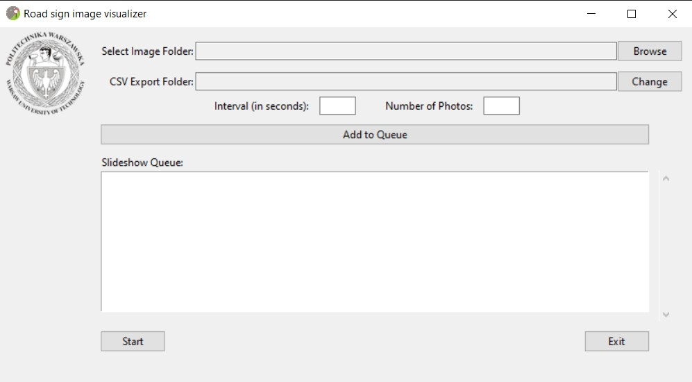

[![Contributors][contributors-shield]][contributors-url]
[![Forks][forks-shield]][forks-url]
[![Stargazers][stars-shield]][stars-url]
[![Issues][issues-shield]][issues-url]


<br />
<div align="center">
  <a href="https://github.com/OLuke-dot/RoadSignVisualizer">
    
  </a>

  <h3 align="center">Road sign vsualizer</h3>

   <p align="center">
    Simple python program for displaying images
    <br />
    <br />
    <a href="https://github.com/OLuke-dot/RoadSignVisualizer/issues">Report Bug</a>
    ·
    <a href="https://github.com/OLuke-dot/RoadSignVisualizer/issues">Request Feature</a>
  </p>
</div>

<!-- TABLE OF CONTENTS -->
<details>
  <summary>Table of Contents</summary>
  <ol>
    <li>
      <a href="#about-the-project">About The Project</a>
    </li>
    <li>
      <ul>
        <li><a href="#prerequisites">Prerequisites</a></li>
        <li><a href="#installation">Installation</a></li>
      </ul>
    </li>
    <li><a href="#license">License</a></li>
    <li><a href="#contact">Contact</a></li>
    <li><a href="#acknowledgments">Acknowledgments</a></li>
  </ol>
</details>


<!-- ABOUT THE PROJECT -->
## About The Project


This is a simple program based on python for displaying multiple amount of images on the screen for a specific period of time. It uses tkinter and pillow library and has a simple GUI for setting parameters. The main focus of the program was for displaying traffic signs from the datasets with specific parameters, but it can be used for different other purposes

* Simple and clear GUI for setting parameters
* All images are presented in fulscreen mode
* Ability to queue multiple different sets
* Output writing to the CSV file


<p align="right">(<a href="#readme-top">back to top</a>)</p>

### Prerequisites

In order for the program to work, you should have python pillow module. Just use the command presented below:
Pillow
  ```sh
 python3 -m pip install --upgrade pip
 python3 -m pip install --upgrade PIL
  ```

### Installation

_Installation can be performed by simply cloning the repo below_

   ```sh
   git clone https://github.com/OLuke-dot/RoadSignVisualizer
   ```

<p align="right">(<a href="#readme-top">back to top</a>)</p>


## License

Distributed under the MIT License. See `LICENSE.txt` for more information.

<p align="right">(<a href="#readme-top">back to top</a>)</p>


<!-- CONTACT -->
## Contact

OLuke-dot@protonmail.com

My other projects: [https://github.com/OLuke-dot](https://github.com/OLuke-dot?tab=repositories)

<p align="right">(<a href="#readme-top">back to top</a>)</p>

[contributors-shield]: https://img.shields.io/github/contributors/OLuke-dot/RoadSignVisualizer.svg?style=for-the-badge
[contributors-url]: https://github.com/OLuke-dot/RoadSignVisualizer/graphs/contributors
[forks-shield]: https://img.shields.io/github/forks/OLuke-dot/RoadSignVisualizer.svg?style=for-the-badge
[forks-url]: https://github.com/OLuke-dot/RoadSignVisualizer/network/members
[stars-shield]: https://img.shields.io/github/stars/OLuke-dot/RoadSignVisualizer.svg?style=for-the-badge
[stars-url]: https://github.com/OLuke-dot/RoadSignVisualizer/stargazers
[issues-shield]: https://img.shields.io/github/issues/OLuke-dot/RoadSignVisualizer.svg?style=for-the-badge
[issues-url]: https://github.com/OLuke-dot/RoadSignVisualizer/issues
[license-shield]: https://img.shields.io/github/license/OLuke-dot/RoadSignVisualizer.svg?style=for-the-badge
[license-url]: https://github.com/OLuke-dot/RoadSignVisualizer/blob/master/LICENSE.txt
